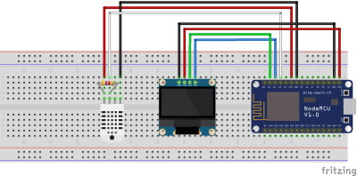
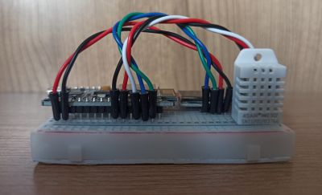
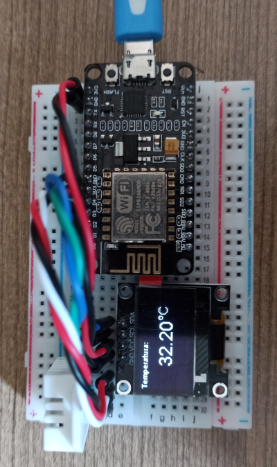
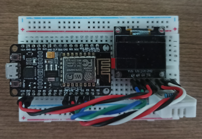

# ESP8266-NodeMCU-Temp-Humid-Monitor
Monitor de tempeatura e humidade utilizando a plataforma IoT NodeMCU.

## Especificações

### Sumário
Projeto IoT para monitoramento de temperatura e humidade. Obtém os dados através de um sensor DHT22 que são exibidos em um display OLED e publicados na internet das coisas através de um serviço MQTT.

### HARDWARE

#### Componentes
* Módulo Wi-Fi ESP8266 NodeMcu
* Display OLED 64x128
* Protoboard 400
* Sensor de temperatura e de umidade DHT22
* Resistor 4k7
* Jumpers Macho x Macho

#### Diagrama

#### Imagens

 
 

### SOFTWARE

ENTRADA: Sensor DHT22 
SAÍDAS:
* Monitor Serial
* Display OLED
* Serviço MQTT

LINGUAGEM: C++ 
IDIOMA: Inglês (EN-US) 
BIBLIOTECAS EXTERNAS:
  * dht
  * mqt

Licença: MIT
